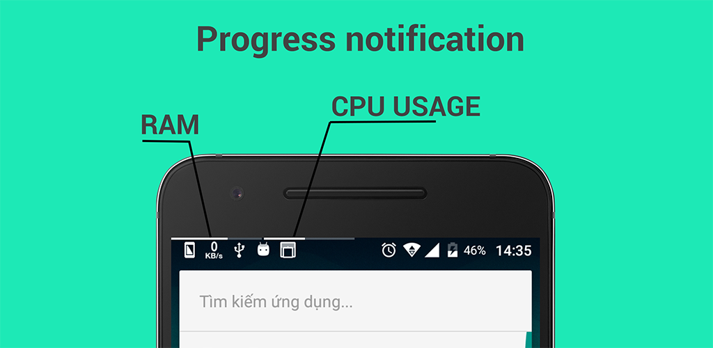

# Progress notification

See app on Google Play Store

The application can track the following information:
1. RAM usage
2. CPU usage
3. CPU temperature
4. Battery level
5. Battery temperature
6. Internal memory usage
7. External memory usage
8. Wifi signal length
9. Network signal length

If you want to contribute to the project, please fork and create pull request.

## License

    Copyright 2017 by Tran Le Duy

    Licensed under the Apache License, Version 2.0 (the "License");
    you may not use this file except in compliance with the License.
    You may obtain a copy of the License at

        http://www.apache.org/licenses/LICENSE-2.0

    Unless required by applicable law or agreed to in writing, software
    distributed under the License is distributed on an "AS IS" BASIS,
    WITHOUT WARRANTIES OR CONDITIONS OF ANY KIND, either express or implied.
    See the License for the specific language governing permissions and
    limitations under the License.